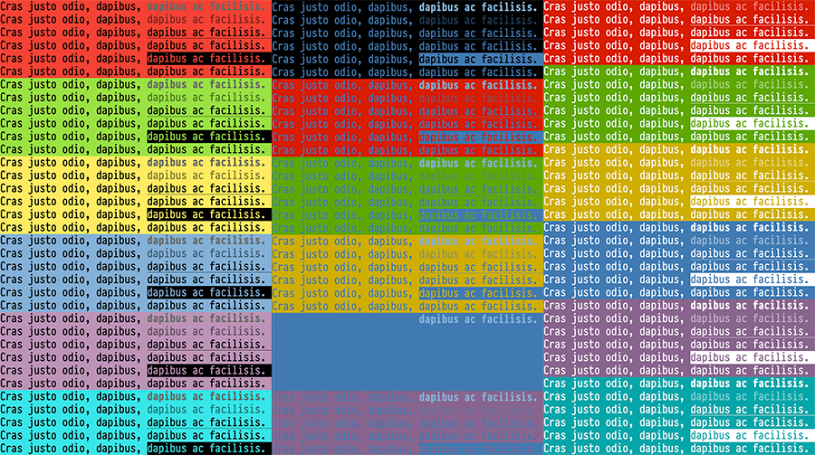

# PHP CLI colors
Simple color constants to output background / foreground colors in cli (bash, cmd, powershell...)



## Why?

There are several options to colorize CLI outputs from PHP but I find them innecesary complex (from my point of view), I think it's much easier use some well defined constants instead classes and objects.

## How to use

```php
echo cli_red, "My string", cli_eol;
// Outputs "My string" in red color and a final breakline (\n)

echo cli_yellow, cli_blue_bg, "My string", cli_eol;
// Outputs "My string" in yellow over blue background and a final breakline (\n)
```

It's important yo notice that **color settings will continue to affect CLI outputs in all the sebseuquential echoes**. To reset the CLI colors to it's default values use `cli_reset`;

```php
echo cli_red, "Red text", cli_ellow, "Yellow text", cli_eol;
echo cli_reset, "This will be in default CLI color.", cli_eol;
```

## Available colors

Foregrounds
```
cli_default
cli_black
cli_red
cli_green
cli_yellow
cli_blue
cli_magenta
cli_cyan
cli_grey

cli_light_red
cli_light_green
cli_light_yellow
cli_light_blue
cli_light_magenta
cli_light_cyan
cli_white

// Not in all systems
cli_light_red_alt
cli_light_green_alt
cli_light_yellow_alt
cli_light_blue_alt
cli_light_magenta_alt
cli_light_cyan_alt
cli_white_alt
```

Backgrounds
```
cli_default_bg
cli_black_bg
cli_red_bg
cli_green_bg
cli_yellow_bg
cli_blue_bg
cli_magenta_bg
cli_cyan_bg
cli_grey_bg

cli_dark_grey_bg
cli_light_red_bg
cli_light_green_bg
cli_light_yellow_bg
cli_light_blue_bg
cli_light_magenta_bg
cli_light_cyan_bg
cli_white_bg
```

Text modifiers
````
cli_bold
cli_dim
cli_underline
cli_blink
cli_reverse
cli_hidden
````

For instance
```php
echo cli_red_bg, "White text over red bg", cli_reverse, "Red text over white bg", cli_reset, cli_eol;
```

## Helpers

Four helpers are included, in order to show error / warnings / infos / successes...


```php
cli_error
cli_warning
cli_info
cli_success
```

```php
echo cli_error, "Error message!", cli_reset;
```

## Tests

Run `php -f cli-colors-test.php` from your CLI.

## TO-DO

¿Convert to composer module?